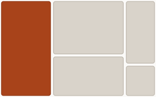
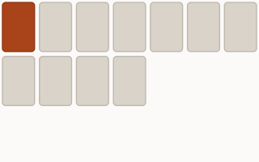

# Ferrite

[Website & visual tour](https://vhark.github.io/Ferrite/) · [User guide](docs/GUIDE.md) · [Roadmap & release status](docs/BACKLOG.md)

A window layout manager for macOS (Linux planned). Ferrite remembers where your windows live, restores whole workspaces with one hotkey, and lets windows snap together into **magnet groups** that move, resize, and reflow as one.

Ferrite is *not* a classic auto-tiler: windows stay free-floating and may overlap. Structure is something you opt into, one edge at a time.

## Highlights

- **Position persistence** — every app's windows are remembered automatically and restored when the app relaunches, when you log in, or when your display configuration changes. No setup.
- **Workspaces** — snapshot your whole desktop as a named layout, per display. One hotkey restores everything: running apps snap into place, missing apps are launched and placed, stacking order included.
- **Magnet groups** — drag a window near another's edge and they mate flush. Tune the reach in Preferences → Magnets (32 pt by default). Choose Shrink or Nudge for shared-edge resizing and proportional outer-edge scaling, or Standard to resize only the window you grabbed. ⌘-drag carries the cluster.
- **Reflow presets** — one click tiles a display, or a magnet group, into columns, rows, grid, main+side (either hand), main-centre, a BSP dwindle spiral, cascade, monocle, or a weighted treemap that sizes windows by rank. Click Columns or Rows again on the display row to reverse the window order. Define your own too: a fixed column count, an exact X×Y grid of zones, or a main-centre split with your own proportions.
- **Private by design** — window titles are never written to disk, only salted hashes. The data files are built to be synced (git, Nextcloud) without leaking your browsing history.

## A few layouts

These diagrams come from Ferrite's own layout solver, not screenshots. The rust-colored tile marks the frontmost window in these display-reflow examples.

| Main in the centre | Weighted treemap | Custom grid, 7 × 3 |
|:---:|:---:|:---:|
|  |  |  |
| Keep the main window central. | Give higher-ranked windows more room. | Unused zones stay empty. |

Apply a preset to a whole display or just one magnet group. Display reflow dissolves touched groups by default; enable **Keep magnet groups together** to preserve them as single tiles. [Explore all presets on the website →](https://vhark.github.io/Ferrite/#reflow)

## Install

**Homebrew** — available once the first notarized release (1.0) ships:

```sh
brew tap vhark/ferrite https://github.com/vhark/Ferrite.git
brew install --cask ferrite
```

**From source** (Swift 5.9+, macOS 13+):

```sh
git clone https://github.com/vhark/Ferrite.git && cd Ferrite
./scripts/install.sh
```

This builds `Ferrite.app`, installs it to `/Applications`, and registers Launch at Login. On first run, macOS will ask you to grant **Accessibility** permission (System Settings → Privacy & Security → Accessibility) — Ferrite cannot see or move windows without it. If Login Items shows "needs approval," allow Ferrite there too.

Optional, for rebuild-stable permissions during development: create a self-signed **"Ferrite Dev"** code-signing identity (see the guide's *Building from source* section). Without it, builds are ad-hoc signed and macOS drops the Accessibility grant on every rebuild.

## Quick start

1. Arrange your windows the way you like.
2. Menu bar icon → **Save Current Arrangement as Layout…**, give it a name.
3. Open **Preferences… → Layouts** and record a hotkey for it.
4. Rearrange everything, then press the hotkey: your workspace comes back — including apps that weren't running.
5. Drag one window's edge close to another's until the blue bar appears, release — they're mated. ⌘-drag either one to carry both.

## Documentation

The full manual — every gesture, menu item, preference, CLI diagnostic, and troubleshooting recipe — is in [`docs/GUIDE.md`](docs/GUIDE.md).

## Status

macOS-first and used daily by its author. The core engine (`FerriteCore`) is pure Foundation with no AppKit dependency; Linux support is planned.

**273 unit tests passing.** Tagged milestones have live-acceptance records in the [backlog](docs/BACKLOG.md). M6 reflow presets v2 and Standard resize mode are implemented on `main`; their live walkthrough is in progress, so `v0.12.0-m6` has not been tagged. The first notarized release and Homebrew installation remain pending.

## Acknowledgments

- [Rectangle](https://github.com/rxhanson/Rectangle) (Ryan Hanson, MIT) — the proven position→size→position AX write sequence Ferrite's window driver uses, and the original seed of the exclude list (now evidence-based via `--probe-frame`).
- [KeyboardShortcuts](https://github.com/sindresorhus/KeyboardShortcuts) (Sindre Sorhus, MIT) — global hotkey recording and registration.

## License

[MIT](LICENSE).
